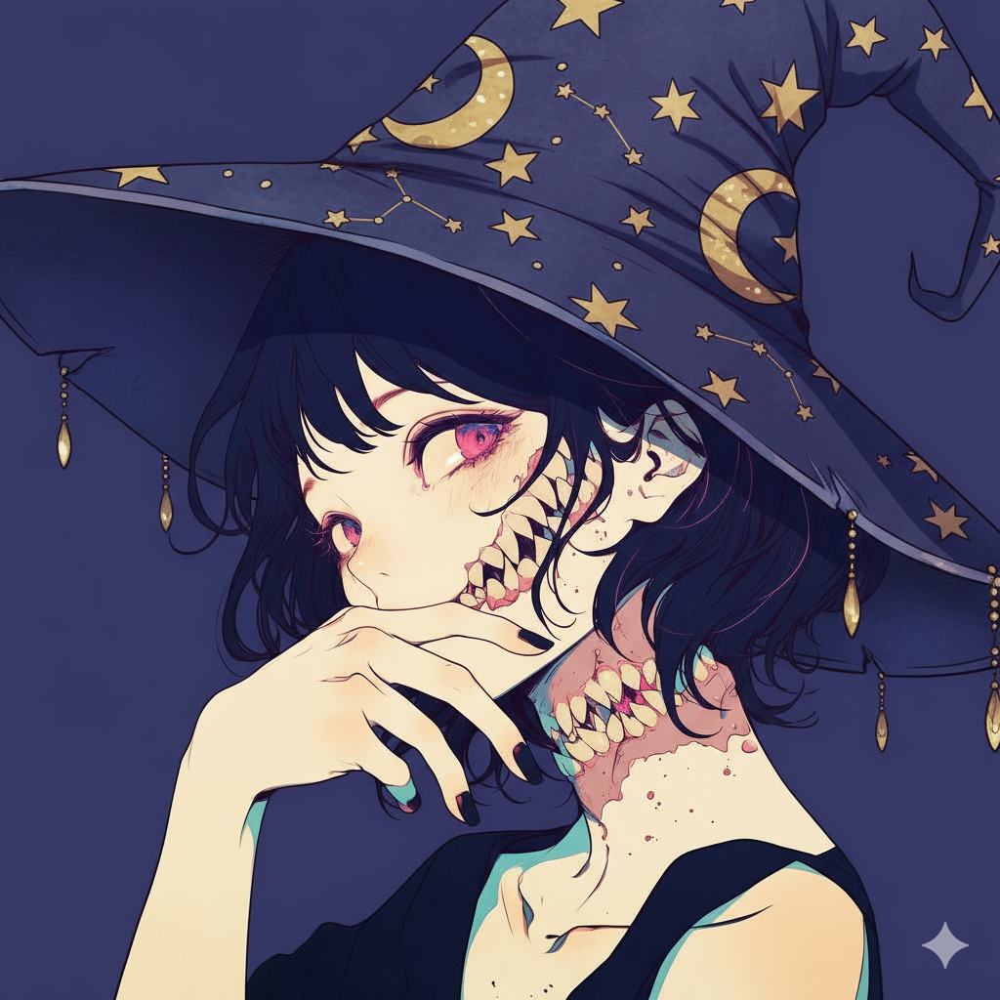

# MAGGxDND

- Кроссовер 2 интересных вещей в моей жизни. Первое - это то, что ондажды заставило меня впервые загуглить, что такое API, затем узнать, что такое web и http, а второе еще в мою и без того нескладную персону добавила дополнительную нотку нёрдости. И, да, это вторая попытка доделать оба проекта, которые по одному в разное время умерли из-за нехватки навыков и запала, огромнейшей фрустрации, которая появлялась при столкновении фактов того, что по идее я сделал все, что смог, но кривищна моей реализации не раскрывала потенциал задумки. Сейчас мало, что поменялось, но, надеюсь, сейчас получится довести это до какого-то результата. (это я пишу в первый вечер работы над обновленным проектом _13.01.2026_)

- Пишу-пишу-пишу. Игорь натолкнул на очень интересную идею. Пусть каждый объекс остается самодостаточной сущностью. Тогда я могу плодить NPC сколько мне уодно и они не будут перегружать контекст своим присутствием. Мастер тогда становится таким же персонажем, но с более слодными инструкциями и большими привилегиями. Остается еще сделать движок, к интерфейсу которого будут обращаться все сущности для игры. Придумать правила тоже надо. Еще, чтобы это работало, нужно придумать систему, которая будет распространять события по всем персонажам, чтобы они уже действовали основываясь на своей реакции на них. Мастер рассказывает, что происходит внутри движка пользователям, а еще определяет сюжет и может влиять на все.  (_22.01.2026_)

- Пишу уже больше недели (конечно, с большими перерывами) и еще ни разу не щапускал целиком. Видимо, я очень сильно хочу разочароваться, когда оно не заработает, когда придет время. По возможности, конечно, я тестирую компоненты, но мне кажется, что я это не проглочу - маловат. (_24.01.2026_)

---

  

__The project depends on `SKLS_core` btw__

**by anton kozlov**